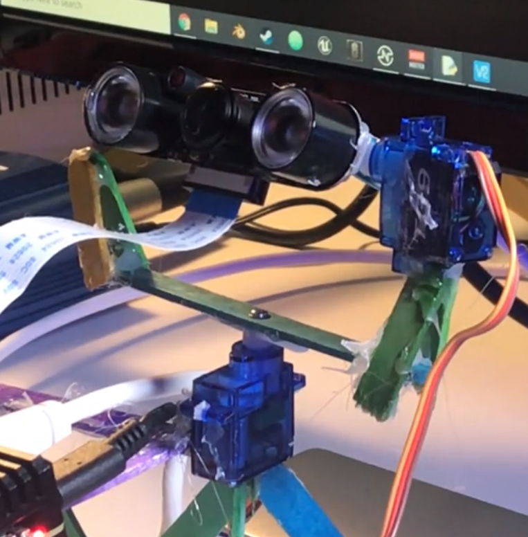

# Face Tracking Turret

Note: This project requires you to have some experience programming in Python.

# Requirements:
-Python 3.6

## Modules:

### Raspberry Pi:
-picamera\
-socketserver\
-pigpiod

### Computer
-numpy\
-cv2\
-pigpio\
-keyboard

# Importing modules
'pip3 install (module name)'

### Before using cameraPositionDebug.py make sure to run 'sudo pigpiod' on the raspberry pi

# Configuring turret.py variables
ip - run 'ifconfig' on raspberry pi, the ip is in wlan0 section\
horizontalPin - GPIO pin the horizontal servo is connected to\
verticalPin - GPIO pin the vertical servo is connected to

Please use cameraPositionDebug.py to get the horizontal rest and vertical rest positions

# Running the turret
1. Run 'sudo pigpiod' on the raspberry pi
2. In the same terminal, navigate to the folder with webServer.py
3. Run 'sudo python3 webServer.py'
4. On the computer, now, run turret.py
5. It should now work, please, bring it to my attention if my instrutions were unclear at all or if you encounter any error.
